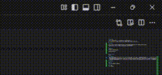

# 🍞mctoast
一个基于tkinter的，用于显示minecraft风格的toast的库  
目前被[CamMoitor](https://github.com/SystemFileB/CamMonitor_Server)使用

## 📦安装
```
$ pip install mctoast //现在我还没有上传pypi，你可以试试手动构建，或出门右转github action
$ pip install mctoast-1.0-py3-none-any.whl //现在先用这个
```

## 🖼️画廊
原版效果:  


mctoast模仿的效果:  


## ⚙️使用方法
见wiki

## ⚠️版权信息
- 这个库与Mojang,Microsoft**没有任何关系**，且在正式的库中(我在示范中使用了红色床的图片)**不使用**client.jar，.minecraft/assets文件夹下的**任何文件**    
- Toast纹理来自[VanillaXBR](https://modrinth.com/resourcepack/vanillaxbr)，基于[CC-BY-NC-4.0](https://creativecommons.org/licenses/by-nc/4.0/legalcode)许可证开源
- 若遇到了相关的许可证问题，请第一时间[提交issue](https://github.com/SystemFileB/mctoast/issues)并加上 版权或许可证问题 标签

## 更新日志

### 1.01
- 修复：进度图片显示不正常

### 1.00
- 第一次发布